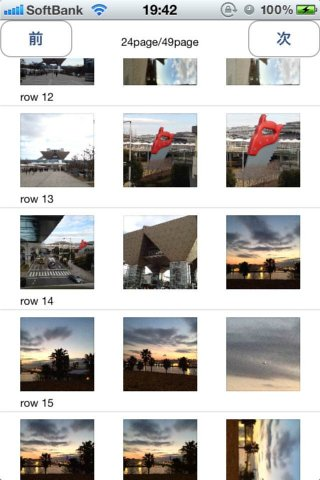

TableViewALAssetsLibrary
========================

ALAssetsLibraryとTableViewでカメラロールの画像一覧を取得する（ソースは適当）
ボタン送りに対応してます。

作成手順
---

1. プロジェクトの新規作成で「Single View Application」を選択
1. StoryBoardとARCを選択して作成
1. StoryBoardを使ってTable View とTable View Cell をViewに突っ込む
1. Cellのidentifierを「photolistCell」とする
1. ViewControllerのClassを「StudyViewController」にする
1. あとは適当にボタンとかラベルとかを上部につける
(ここまでがStoryBoardによるGUIでの操作)
1. ProjectのSummary（BuildSettingsとかがあるところにある）の「Linked Frameworks and Libraries」から「AssetsLibrary.framework」を選択して追加
1. あとはコードに読む

あと著作権とか特になし。
完全無料の完全無保証。
使用する場合は自己責任で。
